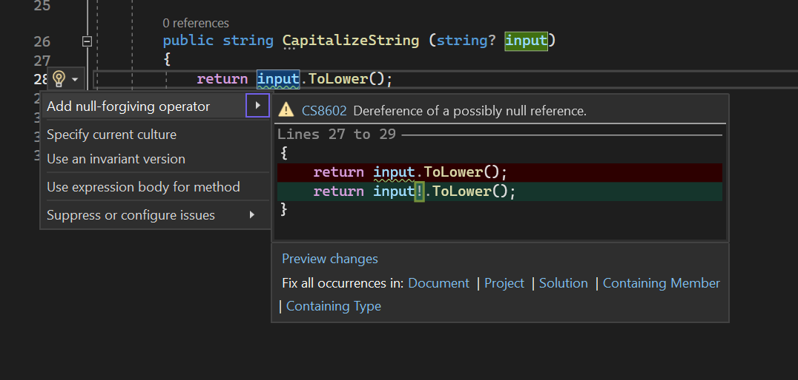

Nulless.bang is an amazing CS8602 compiler analyzer for .NET C# projects. It's designed to help you migrate to strict nullable reference types mode while keeping your legacy code intact. Embrace null safety while giving yourself the flexibility to improve null handling in new code over time! 🎉🔧

## Why Nulless.bang? 🤔

- 👌 Easily silence CS8602 warnings in your legacy code
- 🛡️ Gradually improve null safety in your codebase
- 🧹 Maintain compatibility with existing code while writing safer new code
- 🤗 Enjoy a smoother migration experience to strict nullable reference types mode

## How to Get Started 🚀

1. **Migrate** to strict mode

```xml
<PropertyGroup>
  <TargetFramework>net7.0</TargetFramework>
  <Nullable>enable</Nullable>
</PropertyGroup>
```

2. **Install** the Nulless.bang tool as a dependency for your project, through NuGet 'Nullness.Bang'

3. **Migrate** using Visual studio



4. **Iterate** on your codebase, addressing CS8602 warnings in new code and gradually improving null handling.

## Join the Nulless.bang Community 🌟

Don't hesitate to reach out with any questions, feedback, or suggestions. We're here to support you and help you transition to null safety in your .NET C# projects at your own pace. Together, let's make null reference exceptions a thing of the past! 🥳

Happy coding! 🚀🌟
